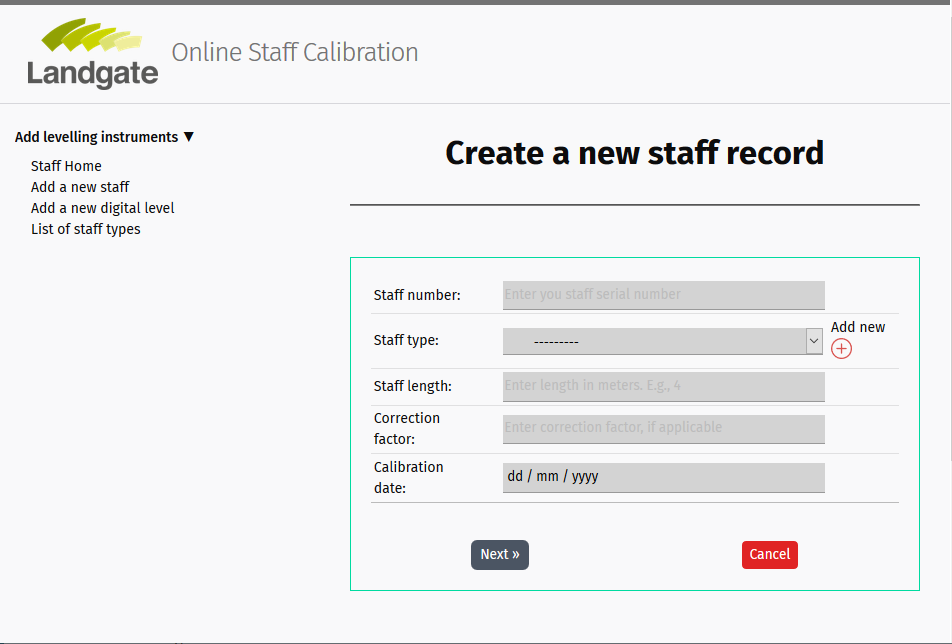

Working with forms
==================

Overview
--------

An HTML Form is a group of one or more fields/widgets on a web page that is used to collect information from users for submission to a server. Forms are a flexible mechanism for collecting user inputs as they can have various forms of widgets for entering many different types of data, including text boxes, checkboxes, radio buttons, date pickers and so on. Forms are also a relatively secure way of sharing data with the server, as they can send data in POST requests with cross-site request forgery protection.

While **forms** were not introduced prior to this, they were already part of the Django Admin site — for example, the screenshot below shows a form for editing one of our **Staff** models, comprised of a number of selection lists and text editors. The same records added to the models through the admin site can be collected from the users or clients through HTML forms. 

.. figure::  django_admin_site_form.png
   :align:   center

For more information on **forms** and how django handles forms, refer to https://docs.djangoproject.com/en/3.1/topics/forms/. 

Django form handling process
----------------------------

Django's technique of handling the form is very much similar to the how the staff_list.html was presented. The ``view`` gets a request, performs any actions required including reading data from the ``models``, then generates and returns a HTML page (from a ``template``) by passing a ``context``. However, this is a **two-way** process in which the data entered by the user/client is being passed to the server for processing and have mechanisms in place to display simple as well as complicated errors. 

A process flowchart is given below to demonstrate how django handles form requests. 

.. figure::  django_form_handling.png
   :align:   center 

   Process flowchart for django form handling (https://developer.mozilla.org/en-US/docs/Learn/Server-side/Django/Forms)

Based on the diagram above, Django form handling performs the following task:

1. Display the *form* to the user/client when requested such as a user sign up or a registration form.  
2. Receive data from the user once the user clicks the *submit* button (or any similar commands).
3. Clean and validate the user data to check if the inputs are consistent with the model fields. Examples include:
	* Data cleaning - removing spaces after and before text fields
	* Data validation - checking if phone numbers have the right number of digits 
4. Re-display the form, if the data entered is invalid, with error messages. 
5. Perform the required actions (e.g., save data, process data, upload files, send email or display pages, etc.), if the data entered is valid. 
6. When the actions are complete, redirect the user to another page or redirect to the previous page to continue the previous action. 

**Form class**
--------------

The django ``Form`` class is the heart of Django's form handling system. It specifies the fields in the form, their layout, display widgets, labels, initial values, valid values, and (once validated) the error messages associated with invalid fields. The class also provides methods for rendering itself in templates using predefined formats (tables, lists, etc.) or for getting the value of any element (enabling fine-grained manual rendering). Forms can also be split across multiple templates/web pages through the use of **form wizard** application (see, https://django-formtools.readthedocs.io/en/latest/wizard.html). 

Declaring a Form
****************

Forms are constructed in a file called ``forms.py`` inside the application directory. It is not automatically created by *startapp*, so it needs to be created manually and import the ``forms`` library to get the ``Form`` class. The **staff/staffs/forms.py** given below shows how to build a simple form class to add a new staff record:

.. code-block:: python
	
	# filename: forms.py

	from django import forms

	class StaffCreateForm(forms.Form):
		staff_number = forms.CharField(max_length=20, help_text="enter your staff serial number")
		staff_type = forms.CharField(max_length=20, help_text="enter your staff type. E.g., fibreglass")
		staff_length = forms.FloatField(help_text="enter the length of your staff")

Form fields
***********

The ``StaffCreateForm`` have two *String* fields and one *Float* field to store **staff number**, **staff type**, and **staff length**, respectively, and also some help texts to help the users. ``Forms`` share the same field types (and other arguments) as a ``Model`` that is found inside the *models.py* file. See https://docs.djangoproject.com/en/3.1/ref/forms/fields/ for more details about the various fields. Some common arguments in most fields include:

* *required*: the field cannot be left blank, if ``True``
* *label*: the label to describe the fields in HTML. If not provided, Django will create it from the field name by capitalizing the first letter and replacing "_" with spaces (e.g., Staff number)
* *initial*: initial value for the field when the form is displayed
* *widget*: display widget to use with more options
* *help_text*: a text can be display in forms to provide more explanation to users
* *error_messages*: list of error messages for the field
* *validators*: list of functions that will be called on the field when it is validated

Validation
**********

Django provides numerous places to validate the data on top of displaying help texts and placeholders in the form. It is possible to validate a single field by overiding the method ``clean_<fieldname>()`` for the field that requires a check. For example, to remove any left or right extra spaces or tabs entered in the *staff_number* field, the ''StaffCreateForm'' can be modifed as:

.. code-block:: python
	
	...

	class StaffCreateForm(forms.Form):
		staff_number = forms.CharField(max_length=20, help_text="enter your staff serial number")
		...

		def clean_staff_number(self):
			data = self.cleaned_data['staff_number']      # get the required data
			return data.strip()                           # clean and return the data

It is also possible to raise a ``ValidationError`` on some fields that has more than one conditions to be fulfilled. 

ModelForm
*********

To make the task even more efficient, Django has a ``ModelForm`` helper class to create the form from a ``model``. The ``ModelForm`` helper class automatically inherits the form fields form the target model and uses all the information in the model to display the form to the users and saves them to the mapped fields once the validation is complete. It is very convenient for mapping the form to a single model and have the values saved almost automatically after cleaning the data. For example, the ``StaffCreateForm`` can be modified as:

.. code-block:: python
	
	...
	from .models import Staff                     # import the model

	class StaffCreateForm(forms.ModelForm):       # declare the ModelForm subclass

		class Meta:                               # add class Meta 
			model: Staff                          # link the model
			fields  = ['staff_number']            # list of fields to be rendered

		# optional methods
		...

Building the Staff Create Form
------------------------------

Staff form
**********

With some basic knowledge on Django forms, lets create the first HTML form to allow users to add/create/register a new staff record in the Staff Calibration project. The ``form`` field values will all be based on the ``model`` fields, which already has a number of auto validation procedures. For example, ``staff_length`` has a minimum and maximum length to avoid blunders. By revisiting the ``ModelForm`` and extending the ``forms.py`` field: 

1. Create a new file in **staffs** application folder with a name ``forms.py`', if not done already and import the ``forms`` library into the file.    
	
	.. code-block:: python

		# filename: forms.py

		from django import forms  

2. Now import the ``Staff`` and ``StaffType`` models, and create the form class with the assoicated model and also include/exclude the fields through the ``class Meta`` tag as shown below:  
	
	.. code-block:: python

		# filename: forms.py

		from django import forms 
		from .models import Staff, StaffType         # import the model

		class StaffForm(forms.ModelForm):            # create class

			class Meta:
				model = Staff                                 # link the model
				fields = ['staff_number','staff_type', 'staff_length', 'correction_factor','calibration_date']
				# exclude = ['standard_temperature']

3. Add the validation process as given in the original ``Form`` class:

	.. code-block:: python

			# filename: forms.py

			from django import forms 
			from .models import Staff, StaffType         # import the model

			class StaffForm(forms.ModelForm):            # create class

				def clean_staff_number(self):                     # add validation function
					data = self.cleaned_data['staff_number']      # get the required data
					return data.strip()                           # clean and return the data

				class Meta:
					model = Staff                        # link the model
					fields = ['staff_number','staff_type', 'staff_length', 'correction_factor','calibration_date']
					# exclude = ['standard_temperature']
	
	This is now functionally equivalent to the original ``StaffCreateForm`` created by using the ``Form`` class with a added functionality of automatic mapping to the ``Staff`` model. 

View function
*************

HTML forms use **GET** and **POST** methods to deal with forms and data transmission. In a **POST** request, form data are typically encoded and therefore, are used for transmitting data to the server. **GET** requests on the other hand are submitted as Strings and are more suitable for composing URLs. 

As mentioned, the *view* has to render the form when it is first called and then either re-render it with error messages if the data is invalid, or process the user input data (i.e., **POST** request) and redirect to a new page if the data is valid. The following example is a view function use to *render* the ``StaffCreateForm``, validate and process data, and *redirect* to a new page:

.. code-block:: python
	
	# filename: views.py

	from django.shortcuts import render, redirect    # add redirect
	from django.views.generic import ListView

	from .models import Staff 
	from .forms import StaffCreateForm               # import Form

	# Create your views here.

	class StaffListView(ListView):
	    ...
	    
	def staff_create(request):                       # create function
	    if request.method == "POST":
	    	# create form instance and populate with data from request
	    	form = StaffCreateForm(request.POST) 
		    if form.is_valid():                          # required as validation procedure
		        form.save()                              # save data
		        return redirect ('/staffs')              # redirect to the staffs home after saving the data
		else:
			# if request is not post, create a blank form 
			form = StaffCreateForm()
		    context = {
		        'form': form                              # pass the form to context
		        }

	    # render the form template with the context
	    return render(request, 'staffs/staff_create.html', context) 

Based on the above code snippet, the process is:

1. Import the form (``StaffCreateForm``) from ``forms.py`` and a number of django functions to complete the action - *render* and *redirect* 
2. Create the view function (``staff_create``), define the form and call ``render()`` to render the specified HTML template by passing the *form* as the ``context``.
3. If the request is **POST**, create the *form* object and get the form data from the request. The form data will then be validated through the ``is_valid`` function (which includes all the validations set in the model). 
4. If the form is not valid, the ``render`` function is called again and also displays the error messages associated with the errorneous fields. 
5. If the form is valid, the form data may undergo further validation and/or data processing or save the data to the database. In this case, the form data is simply saved to the database through the ``form.save()`` command. 
6. After the save, it is then redirected to the **staffs** home page using the ``redirect`` method. 

**Note**: The ''staff_type'' field is a ``ChoiceField`` inherited from the ''StaffType`` model, which is a separate model created to record the different staff types - e.g., invar, fibreglass, steel, wood. The ``Staff`` model inherits them as a ChoiceField and allows to select one. Thus, it is important to add some staff type records before proceeding with the form submission. 

Template
********

The HTML template associated with the ``staff_create`` view function is called *staff_create.html* and is located under **staff/staffs/templates/staffs**. The template design is very similar to the home page but now accepts the *form* as the context. 

.. code-block:: html

	
	

	<article class="post">
	  	<header class="post-header">
	    	<h1 class="post-title text-center">Create a new staff record </h1>
	  	</header>
		

		 
		

			<form class="site-form" method="post">
			    
			    <table>
			    	{{ form.as_table }}
			    </table>

				<input type="submit" value="Submit">
			</form>
		

	</article>

	

In the code snippet above, the ``form`` tag (i.e., ``<form>...</form>``) has a ``method`` for submitting the data (set to **POST**), the *form* inside the ``table`` tag and a ``submit`` button to submit the form data. The ```` see just below the form open tag is part of Django's cross-site forgery protection and must be added to all templates that uses the **POST** request method. 

The *form* itself is accessed by the template by the variable ``{{ form }}`` that can be further translated into a table form as ``{{ form.as_table }}``. 

URL Configurations 
******************

Open the **staffs** URL configuration file (**staff/staffs/urls.py**) and add the following lines to create the url resource for the ``staff_create`` view:

.. code-block:: python
	
	# file-name: urls.py

	...

	urlpatterns += [
		path('staff_create', views.staff_create, name='staff_create'),
	]

``staff_create`` is a function-based view that is being added as ``views.staff_create`` with a name ``staff_create`` for the local URL path ``http://127.0.0.1:8000/staffs/staff_create``. If everything worked ok, the final form template will look like this:

Note that the above form has two buttons - (1) *Next* and (2) *Cancel* indicating you can either go to the next process of submission or simply cancel the submission. This is done by replacing ``<input type="submit" value="Submit">`` by the following lines:  

.. code-block:: html 

	/* Add the appropriate styles through CSS */

	

		

			<button class="px-2 py-1 border border-transparent text-sm leading-1 font-small rounded-md text-white bg-gray-600 hover:bg-gray-500 focus:outline-none focus:shadow-outline transition duration-150 ease-in-out" type="submit"> Next &raquo; </button>
		

		

			<a class="px-2 py-2 border border-transparent text-sm leading-3 rounded text-white bg-red-600 hover:bg-red-500 focus:outline-none focus:shadow-outline transition duration-150 ease-in-out" href="">Cancel</a>
		
 
	

The first button (``Next``) of type **submit** does the same thing as the previous one. The second button (``Cancel``) is a ``<a> ... </a>`` tag containing a ``url`` tag to return to the **staffs** homepage (**/staffs/**) when clicked. 

Updating a Staff record
-----------------------

The technique of creating a **Update** record page is very similar to building a **Create** record page as described above. The only difference is that Django has to know which record to update. This is done by passing a ``model`` instance into the ``form``. Use the following instructions to create a simple update page:

1. **View** - Create a function called ``staff_update`` in ``views.py`` and add the following lines:
	
	.. code-block:: python

		...
		from django.shortcuts import get_object_or_404              # add this line

		def staff_update(request, id):                              # add this function
		    # fetch the object related to object id
		    this_staff = get_object_or_404(Staff, id=id)
		    # Pass the staff object as instance in the form
		    form = StaffCreateForm(request.POST or None, instance = this_staff)
		    if form.is_valid():
		        form.save()
		        return redirect('staffs:staff_list_home')                   # redirect to home page
		    else:
		        context = {
		            'form': form
		        }
		    return render(request, 'staffs/staff_update.html', context)

	The ``StaffCreateForm`` accepts a new parameter called ``instance``, which is a object fetched from the ``Staff`` model using ``get_object_or_404`` for a particular record represented by a unique primary key such as **id**. 

2. **URL Configuration** - The **id** is passed from the urls.py as:

	.. code-block:: python

		urlpatterns += [
			path('staff_update/<id>/', views.staff_update, 'staff_update'),
		]

3. **Template** - The **staff_update.html** template is same as the *staff_create.html* template except that the button text is changed from "Next" to "Update".

4. **Testing the page** - Add some staff records if not done already and type ``http://127.0.0.1:8000/staffs/staff_update/1/`` to see the details for the **first** staff record. All fields now become editable and can be saved by clicking the ``Update`` button. 
